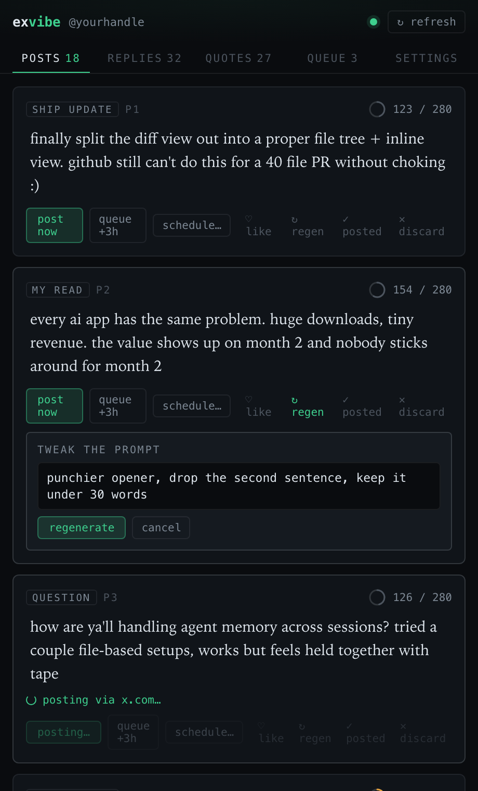
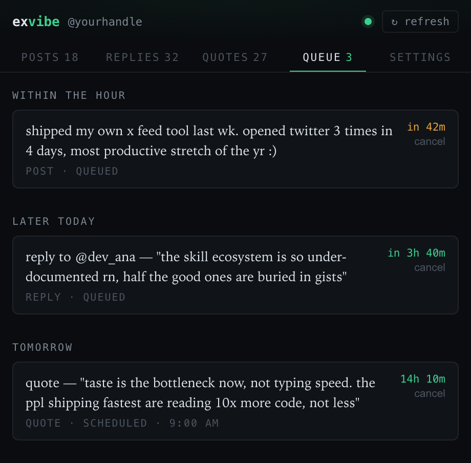
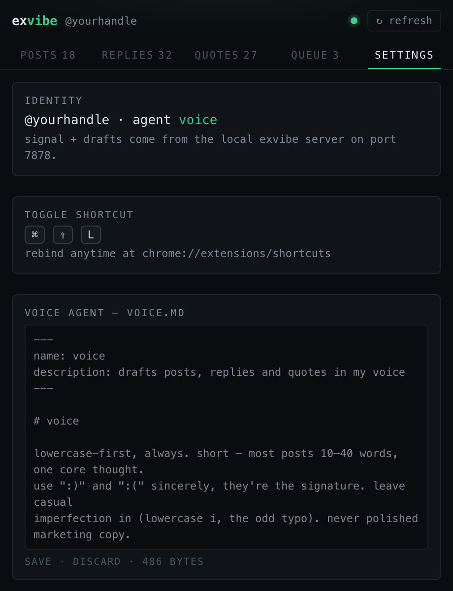

# exvibe

**An X (Twitter) growth cockpit that lives in a Chrome side panel — drafts posts, replies, and quotes in your own voice, then publishes them by emulating a real human at the keyboard, not an API.**

exvibe pairs a local companion server (reads your X signal, drafts in your voice with Claude, learns from your feedback) with a Chrome MV3 side panel that posts through the *real* x.com UI in your logged-in tab. Nothing is ever sent through the X API — because API/CLI posting measurably hurt reach.

<p align="center">
  
</p>

---

## Why posting is emulated, not API-driven

This is the whole point of the project.

Earlier automation posted straight through an API/CLI. **Analytics tanked** — reach dropped and followers slid even while the cadence stayed high. Doing the exact same posts *by hand* performed roughly 10× better. X's ranking clearly favors posts that originate from genuine browser interaction.

So exvibe splits cleanly in two, and **the server never posts anything**:

| Concern | Where | How |
| --- | --- | --- |
| Read signal — bookmarks, likes, home feed, your posts | **Server** | read-only `agent-reach` twitter CLI |
| Interest signature + feed scoring | **Server** | ported scoring pipeline |
| Draft posts / replies / quotes in your voice | **Server** | `claude --agent <voice>` |
| Voice learning (feedback → eval → voice state) | **Server** | append-only feedback + daily eval |
| **Posting / replying / quoting** | **Extension** | types into x.com's real composer as **trusted input** |
| **Queue + scheduling + history** | **Extension** | `chrome.alarms` + `chrome.storage` |

When the extension posts, it focuses your composer and types character-by-character with randomized human cadence, then clicks Post — the same DOM path you'd take by hand. Because a side panel doesn't hold document focus (which makes ordinary synthetic input silently no-op on x.com), the keystrokes are injected as genuinely **trusted** events via the Chrome DevTools Protocol, then the debugger detaches. After a successful post it records a feedback signal back to the server so your voice model keeps learning.

---

## What it looks like

<table>
  <tr>
    <td width="33%" valign="top"><br><sub><b>Posts / Replies / Quotes</b> — edit inline, live 280 counter, regenerate with a prompt tweak, like / mark-posted / discard to teach your voice.</sub></td>
    <td width="33%" valign="top"><br><sub><b>Queue</b> — queued and scheduled items grouped by when they fire, with live countdowns and one-click cancel.</sub></td>
    <td width="33%" valign="top"><br><sub><b>Settings</b> — identity, the toggle shortcut, and an inline editor for your voice agent.</sub></td>
  </tr>
</table>

---

## Features

- **Side panel on x.com**, toggled with a keyboard shortcut — your cockpit sits next to the timeline.
- **Drafts in your voice** across three lanes — original posts, replies to feed tweets, and quote-tweets — generated by a Claude agent tuned to how *you* actually write.
- **Regenerate with a prompt tweak** — not happy with a draft? Type "punchier opener, drop the hashtag" and get a fresh take.
- **Human-emulated publishing** — post now types into the real composer and clicks Post; no API, no bot fingerprint.
- **Queue & schedule** — "queue +3h" chains posts on a cadence, or schedule an exact time; a background alarm fires them into your logged-in tab.
- **A voice that learns** — like / mark-posted / discard are training signal. A daily eval contrasts what you kept vs. discarded and retunes the voice model.
- **Editable voice agent** — tweak the persona markdown right in Settings.

---

## Getting started

**1. Companion server** (Bun + TypeScript):

```sh
cd server && bun install && bun start
```

Serves `http://127.0.0.1:7878` (override with `EXVIBE_PORT`).

**2. Extension** (Vite + React + Tailwind, MV3):

```sh
cd extension && bun install && bun run build
```

Then in Chrome: `chrome://extensions` → enable **Developer mode** → **Load unpacked** → select `extension/dist`.

**3. Open the panel** with the toolbar icon or `⌘⇧L` (mac) / `Ctrl+Shift+L` (other). Rebind at `chrome://extensions/shortcuts` if it clashes. Hit **↻ refresh** to run the pipeline and populate your drafts.

### Configuration

The server reads config from your shell env (or `~/.agent-reach/env.sh`):

| Variable | Purpose | Default |
| --- | --- | --- |
| `TWITTER_HANDLE` | your handle, no `@` | — (required) |
| `DASHBOARD_AGENT` | Claude agent name for your voice | `voice` |
| `DASHBOARD_AGENT_MD` | path to the agent markdown | `~/.claude/agents/<agent>.md` |
| `EXVIBE_PORT` | server port | `7878` |

**Prerequisites:** the `claude` CLI with a voice agent, the `agent-reach` `twitter` CLI on `PATH` for read-only signal, and Bun. Your local state (drafts, signature, feedback, voice) lives in `server/data/` and is gitignored — it never leaves your machine.

---

## Architecture

```
┌──────────────────────────── Chrome ────────────────────────────┐
│  Side panel (React)        Service worker            Content    │
│  ─ Posts/Replies/Quotes    ─ message router          script     │
│  ─ Queue / Settings   ⇄    ─ chrome.alarms queue  ⇄  ─ types +   │
│  ─ edit / regenerate       ─ trusted-input (CDP)      clicks on  │
│                            ─ posted history           x.com     │
└───────────────┬─────────────────────────────────────────────────┘
                │  http://127.0.0.1:7878  (read + draft only)
┌───────────────┴──── Companion server (Bun) ────────────────────┐
│  signal (agent-reach) → interest signature → feed scoring       │
│  → draft via `claude --agent` → voice state → feedback / eval   │
│  state: server/data/*.json                                       │
└─────────────────────────────────────────────────────────────────┘
```

- `extension/` — MV3 extension: `panel/` (UI), `content/` (x.com emulation engine), `background/` (router, scheduler, CDP typing), `shared/` (typed contracts).
- `server/` — Bun HTTP API + the drafting/voice/eval pipeline.
- `docs/` — the design docs behind the build (dashboard port spec, x.com DOM brief, plan).

---

## Status

Early and evolving. The panel, drafting pipeline, voice-learning loop, and queue/scheduling are in place; the trusted-input posting path is implemented and being hardened against x.com's frequently-changing DOM. Selectors are matched defensively and logged on miss so breakage is easy to spot and patch. Not affiliated with X.

## Tech

TypeScript throughout · Bun · React 18 · Tailwind · Vite + CRXJS (MV3) · Chrome side panel, alarms, storage, and debugger APIs · Claude for drafting.
